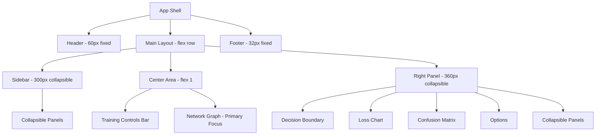
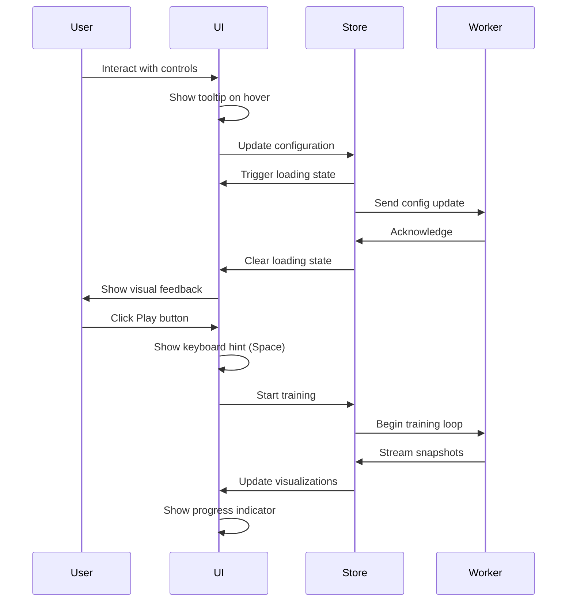

# Design Document: UI Redesign

## Overview

This design outlines a comprehensive UI redesign for the Neural Network Playground that addresses layout constraints, visual hierarchy issues, and usability gaps while maintaining the current React + Zustand + Web Worker architecture. The redesign prioritizes giving the network graph more prominence, improves component organization with better spacing, adds essential UI polish (tooltips, loading states, keyboard hints), and introduces minimal new features that significantly enhance UX (collapsible panels, training progress indicator). The goal is to transform the functional but cramped interface into a modern, polished, and intuitive educational tool.

## Architecture Overview

The redesign maintains the existing three-column layout but with improved proportions and breathing room:



### Key Architectural Changes

1. **Expanded Sidebar**: 280px → 300px (more breathing room)
2. **Expanded Right Panel**: 340px → 360px (better visualization sizing)
3. **Taller Header**: 52px → 60px (less cramped metrics)
4. **Collapsible Panels**: Sidebar and right panel sections can collapse to reduce clutter
5. **Training Progress Indicator**: Visual feedback during training in header
6. **Keyboard Shortcut Hints**: Visible hints on training controls
7. **Tooltip System**: Comprehensive tooltips on all interactive elements

## Main Algorithm/Workflow



## Design System Enhancements

### Color System Refinements

```typescript
// Enhanced color tokens with better contrast and hierarchy
interface ColorSystem {
  // Primary colors (unchanged)
  primary: '#7c5cfc';
  primaryDim: '#5a3fd4';
  primaryGlow: 'rgba(124, 92, 252, 0.25)';
  accent: '#00e5c3';
  accentDim: '#00b89d';
  accentGlow: 'rgba(0, 229, 195, 0.2)';
  
  // Enhanced semantic colors
  success: '#22c55e';
  warning: '#eab308';
  error: '#ef4444';
  info: '#3b82f6';
  
  // New: State colors for loading/progress
  loading: '#60a5fa';
  loadingGlow: 'rgba(96, 165, 250, 0.2)';
  
  // Enhanced surface hierarchy
  bgBase: '#0d0f17';
  bgSurface: '#151822';
  bgElevated: '#1c2030';
  bgHover: '#232840';
  bgInput: '#10131c';
  bgOverlay: 'rgba(13, 15, 23, 0.95)'; // New: for tooltips
  
  // Enhanced text hierarchy
  textPrimary: 'rgba(255, 255, 255, 0.92)';
  textSecondary: 'rgba(255, 255, 255, 0.6)';
  textTertiary: 'rgba(255, 255, 255, 0.38)';
  textDisabled: 'rgba(255, 255, 255, 0.2)'; // New
  textOnAccent: '#000';
  
  // Enhanced borders
  borderSubtle: 'rgba(255, 255, 255, 0.08)';
  borderDefault: 'rgba(255, 255, 255, 0.12)';
  borderFocus: '#7c5cfc';
  borderHover: 'rgba(124, 92, 252, 0.4)'; // New
}


// Spacing scale refinements
interface SpacingSystem {
  xs: '4px';
  sm: '8px';
  md: '16px';
  lg: '24px';
  xl: '32px';
  xxl: '48px'; // New: for major section gaps
}

// Typography refinements
interface TypographySystem {
  fontSans: "'Inter', -apple-system, BlinkMacSystemFont, 'Segoe UI', sans-serif";
  fontMono: "'JetBrains Mono', 'Fira Code', monospace";
  
  // Enhanced scale
  textXs: '0.7rem';    // 9.8px
  textSm: '0.8rem';    // 11.2px
  textBase: '0.875rem'; // 12.25px
  textLg: '1rem';      // 14px
  textXl: '1.15rem';   // 16.1px
  text2xl: '1.35rem';  // 18.9px
  text3xl: '1.5rem';   // 21px - New: for empty states
  
  // Line heights
  lineHeightTight: 1.25;
  lineHeightNormal: 1.5;
  lineHeightRelaxed: 1.75;
}
```

### Shadow System

```typescript
interface ShadowSystem {
  sm: '0 1px 3px rgba(0, 0, 0, 0.3)';
  md: '0 4px 12px rgba(0, 0, 0, 0.4)';
  lg: '0 8px 30px rgba(0, 0, 0, 0.5)';
  xl: '0 12px 48px rgba(0, 0, 0, 0.6)'; // New: for modals/overlays
  glow: '0 0 20px var(--color-primary-glow)';
  glowAccent: '0 0 20px var(--color-accent-glow)'; // New
}
```


## Components and Interfaces

### 1. Enhanced Header Component

**Purpose**: Display branding, real-time training metrics, and training progress indicator

**Interface**:
```typescript
interface HeaderProps {
  // No props needed - reads from stores
}

interface HeaderState {
  epoch: number;
  trainLoss: number;
  testLoss: number;
  accuracy?: number;
  isTraining: boolean;
  progress: number; // 0-100, for progress bar
}
```

**Responsibilities**:
- Display brand with improved logo (replace "NN" placeholder)
- Show real-time metrics with better visual hierarchy
- Display training progress indicator when training is active
- Responsive: hide metrics on mobile, show only essential info

**Visual Changes**:
- Height: 52px → 60px (more breathing room)
- Logo: Replace generic "NN" with custom neural network icon
- Metrics: Larger font, better spacing between items
- Progress bar: Thin animated bar at bottom of header during training
- Add subtle animation to metrics when they update

### 2. Collapsible Panel Component

**Purpose**: Reusable collapsible panel wrapper for sidebar and right panel sections

**Interface**:
```typescript
interface CollapsiblePanelProps {
  title: string;
  children: React.ReactNode;
  defaultExpanded?: boolean;
  icon?: React.ReactNode;
  badge?: string | number; // Optional badge (e.g., layer count)
}

interface CollapsiblePanelState {
  isExpanded: boolean;
}
```


**Responsibilities**:
- Smooth expand/collapse animation
- Persist expanded state in localStorage
- Show expand/collapse icon (▸/▾)
- Optional badge for quick info (e.g., "3 layers")

**Implementation**:
```typescript
function CollapsiblePanel({ 
  title, 
  children, 
  defaultExpanded = true,
  icon,
  badge 
}: CollapsiblePanelProps) {
  const [isExpanded, setIsExpanded] = useState(defaultExpanded);
  
  // Persist state in localStorage
  useEffect(() => {
    const key = `panel-${title.toLowerCase().replace(/\s+/g, '-')}`;
    const saved = localStorage.getItem(key);
    if (saved !== null) setIsExpanded(saved === 'true');
  }, [title]);
  
  const toggle = () => {
    const newState = !isExpanded;
    setIsExpanded(newState);
    const key = `panel-${title.toLowerCase().replace(/\s+/g, '-')}`;
    localStorage.setItem(key, String(newState));
  };
  
  return (
    <div className="panel collapsible-panel">
      <div 
        className="panel__header" 
        onClick={toggle}
        role="button"
        aria-expanded={isExpanded}
      >
        <span className="panel__icon">{isExpanded ? '▾' : '▸'}</span>
        {icon && <span className="panel__title-icon">{icon}</span>}
        <span className="panel__title">{title}</span>
        {badge && <span className="panel__badge">{badge}</span>}
      </div>
      <div 
        className="panel__content"
        style={{
          maxHeight: isExpanded ? '2000px' : '0',
          overflow: 'hidden',
          transition: 'max-height 300ms cubic-bezier(0.16, 1, 0.3, 1)'
        }}
      >
        <div className="panel__content-inner">
          {children}
        </div>
      </div>
    </div>
  );
}
```


### 3. Tooltip Component

**Purpose**: Universal tooltip system for all interactive elements

**Interface**:
```typescript
interface TooltipProps {
  content: string | React.ReactNode;
  children: React.ReactNode;
  placement?: 'top' | 'bottom' | 'left' | 'right';
  delay?: number; // ms before showing
  shortcut?: string; // Optional keyboard shortcut to display
}

interface TooltipState {
  isVisible: boolean;
  position: { x: number; y: number };
}
```

**Responsibilities**:
- Show on hover after delay (default 500ms)
- Position intelligently to avoid viewport edges
- Display keyboard shortcuts when provided
- Accessible (aria-describedby)
- Smooth fade-in/out animation

**Implementation**:
```typescript
function Tooltip({ 
  content, 
  children, 
  placement = 'top',
  delay = 500,
  shortcut 
}: TooltipProps) {
  const [isVisible, setIsVisible] = useState(false);
  const [position, setPosition] = useState({ x: 0, y: 0 });
  const timeoutRef = useRef<number>();
  const triggerRef = useRef<HTMLDivElement>(null);
  
  const show = useCallback(() => {
    timeoutRef.current = window.setTimeout(() => {
      setIsVisible(true);
      // Calculate position based on trigger element
      if (triggerRef.current) {
        const rect = triggerRef.current.getBoundingClientRect();
        // Position logic based on placement prop
        setPosition(calculatePosition(rect, placement));
      }
    }, delay);
  }, [delay, placement]);
  
  const hide = useCallback(() => {
    if (timeoutRef.current) clearTimeout(timeoutRef.current);
    setIsVisible(false);
  }, []);
  
  return (
    <>
      <div
        ref={triggerRef}
        onMouseEnter={show}
        onMouseLeave={hide}
        aria-describedby={isVisible ? 'tooltip' : undefined}
      >
        {children}
      </div>
      {isVisible && createPortal(
        <div 
          id="tooltip"
          className="tooltip"
          style={{
            left: position.x,
            top: position.y,
            opacity: isVisible ? 1 : 0,
            transition: 'opacity 150ms ease'
          }}
          role="tooltip"
        >
          <div className="tooltip__content">{content}</div>
          {shortcut && (
            <div className="tooltip__shortcut">
              <kbd>{shortcut}</kbd>
            </div>
          )}
        </div>,
        document.body
      )}
    </>
  );
}
```


### 4. Enhanced Training Controls

**Purpose**: Primary training controls with visible keyboard shortcuts and improved speed selector

**Interface**:
```typescript
interface TrainingControlsProps {
  training: TrainingHook;
}

interface SpeedOption {
  value: number;
  label: string;
  icon?: string; // Optional icon for visual distinction
}
```

**Responsibilities**:
- Display play/pause, step, reset buttons with keyboard hints
- Show prominent speed selector (1×, 5×, 10×, 25×, 50×)
- Display current step and epoch info
- Show training status indicator
- Provide visual feedback for all interactions

**Visual Changes**:
- Keyboard shortcuts visible on buttons (not just in title attribute)
- Speed selector: Larger buttons with better spacing
- Add icons to buttons for better scannability
- Show "Training..." status with animated indicator
- Better visual hierarchy: primary action (play) stands out more

**Implementation**:
```typescript
function TrainingControls({ training }: TrainingControlsProps) {
  const status = useTrainingStore((s) => s.status);
  const snapshot = useTrainingStore((s) => s.snapshot);
  const stepsPerFrame = useTrainingStore((s) => s.stepsPerFrame);
  const setStepsPerFrame = useTrainingStore((s) => s.setStepsPerFrame);
  const isRunning = status === 'running';
  
  return (
    <div className="training-bar">
      <div className="training-bar__controls">
        <Tooltip content="Start/pause training" shortcut="Space">
          <button
            className={`btn btn--play ${isRunning ? 'running' : ''}`}
            onClick={isRunning ? training.pause : training.play}
          >
            {isRunning ? '⏸' : '▶'}
            <span className="btn__shortcut">Space</span>
          </button>
        </Tooltip>
        
        <Tooltip content="Run one training step" shortcut="→">
          <button className="btn btn--ghost" onClick={training.step}>
            Step
            <span className="btn__shortcut">→</span>
          </button>
        </Tooltip>
        
        <Tooltip content="Reset model and regenerate data" shortcut="R">
          <button className="btn btn--ghost" onClick={training.reset}>
            Reset
            <span className="btn__shortcut">R</span>
          </button>
        </Tooltip>
      </div>
      
      <div className="training-bar__speed">
        <span className="training-bar__speed-label">Speed:</span>
        {SPEED_OPTIONS.map((opt) => (
          <Tooltip key={opt.value} content={`${opt.value} steps per frame`}>
            <button
              className={`speed-btn ${stepsPerFrame === opt.value ? 'active' : ''}`}
              onClick={() => setStepsPerFrame(opt.value)}
            >
              {opt.label}
            </button>
          </Tooltip>
        ))}
      </div>
      
      <div className="training-bar__info">
        {isRunning && (
          <span className="training-bar__status">
            <span className="status-indicator" />
            Training...
          </span>
        )}
        {snapshot && (
          <>
            <span>Step {snapshot.step.toLocaleString()}</span>
            <span>Epoch {snapshot.epoch}</span>
          </>
        )}
      </div>
    </div>
  );
}
```


### 5. Preset Preview Cards

**Purpose**: Replace dropdown with visual preset cards for better discoverability

**Interface**:
```typescript
interface PresetCardProps {
  preset: Preset;
  isSelected: boolean;
  onSelect: (preset: Preset) => void;
}

interface Preset {
  id: string;
  title: string;
  description: string;
  learningGoal?: string;
  thumbnail?: string; // Optional preview image
  difficulty?: 'beginner' | 'intermediate' | 'advanced';
  config: PlaygroundConfig;
}
```

**Responsibilities**:
- Display preset as clickable card with preview
- Show title, description, and learning goal
- Indicate difficulty level with badge
- Highlight selected preset
- Smooth hover effects

**Visual Design**:
- Grid layout: 2 columns on desktop, 1 on mobile
- Card: Elevated surface with border, hover effect
- Thumbnail: Small preview of expected decision boundary
- Badge: Difficulty indicator (color-coded)
- Selected state: Primary border color, subtle glow

**Implementation**:
```typescript
function PresetCard({ preset, isSelected, onSelect }: PresetCardProps) {
  return (
    <div 
      className={`preset-card ${isSelected ? 'selected' : ''}`}
      onClick={() => onSelect(preset)}
      role="button"
      tabIndex={0}
    >
      {preset.thumbnail && (
        <div className="preset-card__thumbnail">
          
        </div>
      )}
      <div className="preset-card__content">
        <div className="preset-card__header">
          <h3 className="preset-card__title">{preset.title}</h3>
          {preset.difficulty && (
            <span className={`preset-card__badge preset-card__badge--${preset.difficulty}`}>
              {preset.difficulty}
            </span>
          )}
        </div>
        <p className="preset-card__description">{preset.description}</p>
        {preset.learningGoal && (
          <p className="preset-card__goal">
            <span className="preset-card__goal-icon">💡</span>
            {preset.learningGoal}
          </p>
        )}
      </div>
    </div>
  );
}

function PresetPanel({ onReset }: PresetPanelProps) {
  const [selectedId, setSelectedId] = useState('');
  const applyPreset = usePlaygroundStore((s) => s.applyPreset);
  
  const handleSelect = (preset: Preset) => {
    setSelectedId(preset.id);
    applyPreset(preset);
    onReset();
  };
  
  return (
    <CollapsiblePanel title="Presets" defaultExpanded={true}>
      <div className="preset-grid">
        {PRESETS.map((preset) => (
          <PresetCard
            key={preset.id}
            preset={preset}
            isSelected={selectedId === preset.id}
            onSelect={handleSelect}
          />
        ))}
      </div>
    </CollapsiblePanel>
  );
}
```


### 6. Loading State Component

**Purpose**: Show loading feedback during configuration changes

**Interface**:
```typescript
interface LoadingStateProps {
  isLoading: boolean;
  message?: string;
  inline?: boolean; // Inline vs overlay
}
```

**Responsibilities**:
- Display loading spinner or skeleton
- Show optional message
- Support inline (within component) or overlay (full screen) modes
- Smooth fade-in/out transitions

**Implementation**:
```typescript
function LoadingState({ isLoading, message, inline = false }: LoadingStateProps) {
  if (!isLoading) return null;
  
  if (inline) {
    return (
      <div className="loading-state loading-state--inline">
        <div className="loading-spinner" />
        {message && <span className="loading-message">{message}</span>}
      </div>
    );
  }
  
  return createPortal(
    <div className="loading-overlay">
      <div className="loading-content">
        <div className="loading-spinner loading-spinner--large" />
        {message && <p className="loading-message">{message}</p>}
      </div>
    </div>,
    document.body
  );
}

// Usage in panels
function DataPanel({ onReset }: DataPanelProps) {
  const [isLoading, setIsLoading] = useState(false);
  
  const handleDatasetChange = async (dataset: DatasetType) => {
    setIsLoading(true);
    await store.getState().setDataset(dataset);
    setIsLoading(false);
  };
  
  return (
    <CollapsiblePanel title="Data">
      <LoadingState isLoading={isLoading} message="Generating data..." inline />
      {/* ... rest of panel content ... */}
    </CollapsiblePanel>
  );
}
```


### 7. Empty State Component

**Purpose**: Show helpful empty states before training starts

**Interface**:
```typescript
interface EmptyStateProps {
  icon?: React.ReactNode;
  title: string;
  description?: string;
  action?: {
    label: string;
    onClick: () => void;
  };
}
```

**Responsibilities**:
- Display when no data is available
- Show helpful icon and message
- Optional call-to-action button
- Centered layout with good spacing

**Implementation**:
```typescript
function EmptyState({ icon, title, description, action }: EmptyStateProps) {
  return (
    <div className="empty-state">
      {icon && <div className="empty-state__icon">{icon}</div>}
      <h3 className="empty-state__title">{title}</h3>
      {description && <p className="empty-state__description">{description}</p>}
      {action && (
        <button className="btn btn--primary" onClick={action.onClick}>
          {action.label}
        </button>
      )}
    </div>
  );
}

// Usage in visualizations
function DecisionBoundary({ trainPoints, testPoints, showTestData, discretize }: Props) {
  const snapshot = useTrainingStore((s) => s.snapshot);
  const hasData = trainPoints.length > 0;
  
  if (!hasData) {
    return (
      <div className="decision-boundary">
        <EmptyState
          icon="🎯"
          title="No training data"
          description="Configure your dataset and click Play to start training"
        />
      </div>
    );
  }
  
  // ... existing canvas rendering ...
}
```


### 8. Enhanced Confusion Matrix

**Purpose**: Improve confusion matrix visualization with better labels and colors

**Interface**:
```typescript
interface ConfusionMatrixProps {
  // Reads from store
}

interface ConfusionMatrixData {
  tp: number; // True Positive
  tn: number; // True Negative
  fp: number; // False Positive
  fn: number; // False Negative
}
```

**Responsibilities**:
- Display 2×2 confusion matrix with clear labels
- Use color intensity to show magnitude
- Show percentages in addition to counts
- Highlight correct predictions (TP, TN) vs errors (FP, FN)
- Responsive layout

**Visual Improvements**:
- Larger cells with better spacing
- Show both count and percentage in each cell
- Color coding: Green for correct, Red for errors
- Add row/column totals
- Better axis labels ("Predicted" / "Actual")

**Implementation**:
```typescript
function ConfusionMatrix() {
  const problemType = usePlaygroundStore((s) => s.data.problemType);
  const cm = useTrainingStore((s) => s.snapshot?.testMetrics.confusionMatrix);
  
  if (problemType !== 'classification') return null;
  if (!cm) {
    return (
      <CollapsiblePanel title="Confusion Matrix">
        <EmptyState
          icon="📊"
          title="No test data"
          description="Train the model to see confusion matrix"
        />
      </CollapsiblePanel>
    );
  }
  
  const total = cm.tp + cm.tn + cm.fp + cm.fn;
  if (total === 0) return null;
  
  const Cell = ({ value, label, isCorrect }: { 
    value: number; 
    label: string; 
    isCorrect: boolean;
  }) => {
    const pct = (value / total) * 100;
    const intensity = Math.max(0.1, pct / 100);
    const bgColor = isCorrect 
      ? `rgba(34, 197, 94, ${intensity})` // Green for correct
      : `rgba(239, 68, 68, ${intensity})`; // Red for errors
    
    return (
      <div className="cm-cell" style={{ backgroundColor: bgColor }}>
        <div className="cm-value">{value}</div>
        <div className="cm-percentage">{pct.toFixed(1)}%</div>
        <div className="cm-label">{label}</div>
      </div>
    );
  };
  
  return (
    <CollapsiblePanel title="Confusion Matrix" defaultExpanded={true}>
      <div className="cm-container">
        <div className="cm-grid">
          <div className="cm-header cm-header--empty" />
          <div className="cm-header">Pred 0</div>
          <div className="cm-header">Pred 1</div>
          <div className="cm-header">Total</div>
          
          <div className="cm-header cm-header--side">Actual 0</div>
          <Cell value={cm.tn} label="TN" isCorrect={true} />
          <Cell value={cm.fp} label="FP" isCorrect={false} />
          <div className="cm-total">{cm.tn + cm.fp}</div>
          
          <div className="cm-header cm-header--side">Actual 1</div>
          <Cell value={cm.fn} label="FN" isCorrect={false} />
          <Cell value={cm.tp} label="TP" isCorrect={true} />
          <div className="cm-total">{cm.fn + cm.tp}</div>
          
          <div className="cm-header cm-header--side">Total</div>
          <div className="cm-total">{cm.tn + cm.fn}</div>
          <div className="cm-total">{cm.fp + cm.tp}</div>
          <div className="cm-total cm-total--grand">{total}</div>
        </div>
        
        <div className="cm-metrics">
          <div className="cm-metric">
            <span className="cm-metric__label">Accuracy</span>
            <span className="cm-metric__value">
              {(((cm.tp + cm.tn) / total) * 100).toFixed(1)}%
            </span>
          </div>
          <div className="cm-metric">
            <span className="cm-metric__label">Precision</span>
            <span className="cm-metric__value">
              {cm.tp + cm.fp > 0 
                ? ((cm.tp / (cm.tp + cm.fp)) * 100).toFixed(1) 
                : '0.0'}%
            </span>
          </div>
          <div className="cm-metric">
            <span className="cm-metric__label">Recall</span>
            <span className="cm-metric__value">
              {cm.tp + cm.fn > 0 
                ? ((cm.tp / (cm.tp + cm.fn)) * 100).toFixed(1) 
                : '0.0'}%
            </span>
          </div>
        </div>
      </div>
    </CollapsiblePanel>
  );
}
```


## Data Models

### UI State Model

```typescript
interface UIState {
  // Existing
  showTestData: boolean;
  discretizeOutput: boolean;
  
  // New: Panel collapse states (persisted in localStorage)
  panelStates: {
    [panelId: string]: boolean; // true = expanded
  };
  
  // New: Loading states
  loadingStates: {
    dataGeneration: boolean;
    networkInit: boolean;
    configChange: boolean;
  };
  
  // New: Tooltip state
  activeTooltip: string | null;
  
  // New: Training progress
  trainingProgress: {
    currentEpoch: number;
    targetEpoch: number | null; // null = continuous
    percentage: number; // 0-100
  };
}
```

### Theme Configuration

```typescript
interface ThemeConfig {
  mode: 'dark' | 'light'; // Future: light mode support
  accentColor: string; // Allow customization
  fontSize: 'small' | 'medium' | 'large'; // Accessibility
  reducedMotion: boolean; // Respect prefers-reduced-motion
}
```

### Preset Model Enhancement

```typescript
interface PresetEnhanced extends Preset {
  // Existing fields
  id: string;
  title: string;
  description: string;
  learningGoal?: string;
  config: PlaygroundConfig;
  
  // New fields
  thumbnail?: string; // Base64 or URL to preview image
  difficulty: 'beginner' | 'intermediate' | 'advanced';
  tags: string[]; // e.g., ['classification', 'nonlinear', 'overfitting']
  estimatedTime: string; // e.g., "2-3 minutes"
  author?: string;
}
```


## Interaction Patterns and State Transitions

### 1. Panel Collapse/Expand

**Trigger**: User clicks panel header
**Transition**: Smooth max-height animation (300ms cubic-bezier)
**State**: Persisted in localStorage
**Feedback**: Icon rotates (▸ → ▾), content slides in/out

```typescript
// State transition
COLLAPSED → (click) → EXPANDING → (300ms) → EXPANDED
EXPANDED → (click) → COLLAPSING → (300ms) → COLLAPSED

// Animation
.panel__content {
  max-height: 0; // collapsed
  max-height: 2000px; // expanded
  overflow: hidden;
  transition: max-height 300ms cubic-bezier(0.16, 1, 0.3, 1);
}
```

### 2. Tooltip Display

**Trigger**: Mouse hover over interactive element
**Delay**: 500ms before showing
**Transition**: Fade in (150ms), fade out (100ms)
**Positioning**: Smart positioning to avoid viewport edges

```typescript
// State transition
HIDDEN → (hover + 500ms) → SHOWING → (150ms) → VISIBLE
VISIBLE → (mouse leave) → HIDING → (100ms) → HIDDEN

// Position calculation
function calculatePosition(
  triggerRect: DOMRect, 
  placement: Placement
): Position {
  const tooltipWidth = 200; // estimated
  const tooltipHeight = 60; // estimated
  const gap = 8;
  
  let x = 0, y = 0;
  
  switch (placement) {
    case 'top':
      x = triggerRect.left + triggerRect.width / 2 - tooltipWidth / 2;
      y = triggerRect.top - tooltipHeight - gap;
      break;
    case 'bottom':
      x = triggerRect.left + triggerRect.width / 2 - tooltipWidth / 2;
      y = triggerRect.bottom + gap;
      break;
    case 'left':
      x = triggerRect.left - tooltipWidth - gap;
      y = triggerRect.top + triggerRect.height / 2 - tooltipHeight / 2;
      break;
    case 'right':
      x = triggerRect.right + gap;
      y = triggerRect.top + triggerRect.height / 2 - tooltipHeight / 2;
      break;
  }
  
  // Clamp to viewport
  x = Math.max(8, Math.min(x, window.innerWidth - tooltipWidth - 8));
  y = Math.max(8, Math.min(y, window.innerHeight - tooltipHeight - 8));
  
  return { x, y };
}
```


### 3. Loading State Transitions

**Trigger**: Configuration change (dataset, network, hyperparameters)
**Duration**: Variable (depends on operation)
**Feedback**: Spinner + optional message

```typescript
// State transition
IDLE → (config change) → LOADING → (operation complete) → IDLE

// Store integration
const usePlaygroundStore = create<PlaygroundStore>((set, get) => ({
  // ... existing state ...
  
  setDataset: async (dataset: DatasetType) => {
    set({ loadingStates: { ...get().loadingStates, dataGeneration: true } });
    
    // Perform async operation
    await generateDataset(dataset);
    
    set({ 
      data: { ...get().data, dataset },
      loadingStates: { ...get().loadingStates, dataGeneration: false }
    });
  },
}));
```

### 4. Training Progress Indicator

**Trigger**: Training starts
**Update**: Every frame during training
**Display**: Thin animated bar at bottom of header

```typescript
// State transition
IDLE → (play) → TRAINING → (pause/complete) → IDLE

// Progress calculation
function calculateProgress(
  currentEpoch: number,
  targetEpoch: number | null
): number {
  if (targetEpoch === null) {
    // Continuous training - show indeterminate progress
    return -1; // Special value for indeterminate
  }
  return Math.min(100, (currentEpoch / targetEpoch) * 100);
}

// Render
function TrainingProgressBar() {
  const { currentEpoch, targetEpoch } = useTrainingStore(
    (s) => s.trainingProgress
  );
  const progress = calculateProgress(currentEpoch, targetEpoch);
  
  if (progress < 0) {
    // Indeterminate progress - animated stripe
    return (
      <div className="progress-bar progress-bar--indeterminate">
        <div className="progress-bar__fill progress-bar__fill--animated" />
      </div>
    );
  }
  
  return (
    <div className="progress-bar">
      <div 
        className="progress-bar__fill" 
        style={{ width: `${progress}%` }}
      />
    </div>
  );
}
```


### 5. Preset Selection

**Trigger**: User clicks preset card
**Transition**: Immediate config application + reset
**Feedback**: Card highlights, loading state, then visualization updates

```typescript
// State transition
IDLE → (select preset) → APPLYING → (reset) → RESETTING → IDLE

// Flow
async function handlePresetSelect(preset: Preset) {
  // 1. Highlight selected card
  setSelectedId(preset.id);
  
  // 2. Show loading state
  setLoadingStates({ configChange: true });
  
  // 3. Apply configuration
  await applyPreset(preset);
  
  // 4. Reset training state
  await onReset();
  
  // 5. Clear loading state
  setLoadingStates({ configChange: false });
  
  // 6. Show success feedback (optional)
  showToast(`Applied preset: ${preset.title}`);
}
```

## Responsive Behavior

### Breakpoints

```typescript
const BREAKPOINTS = {
  mobile: 540,      // Single column, stacked layout
  tablet: 860,      // Two columns, sidebar + main
  desktop: 1200,    // Three columns, full layout
  wide: 1600,       // Wider panels, more breathing room
};
```

### Layout Adaptations

**Mobile (< 540px)**:
- Single column layout
- Sidebar panels in accordion at top
- Network graph takes full width
- Right panel sections below graph
- Header shows only logo and play button
- Metrics hidden (available in expandable section)

**Tablet (540px - 860px)**:
- Two column layout: Sidebar + Main
- Right panel moves below main area
- Network graph maintains aspect ratio
- Training controls stack vertically if needed

**Desktop (860px - 1200px)**:
- Three column layout (current)
- Sidebar: 280px
- Right panel: 340px
- Center area: flex 1

**Wide (> 1200px)**:
- Three column layout with more space
- Sidebar: 320px
- Right panel: 380px
- Larger visualizations
- More comfortable spacing


### Responsive CSS Implementation

```css
/* Mobile first approach */
.main-layout {
  display: flex;
  flex-direction: column;
}

.sidebar {
  width: 100%;
  border-right: none;
  border-bottom: 1px solid var(--border-subtle);
}

.right-panel {
  width: 100%;
  border-left: none;
  border-top: 1px solid var(--border-subtle);
}

/* Tablet */
@media (min-width: 540px) {
  .sidebar {
    display: grid;
    grid-template-columns: repeat(2, 1fr);
    gap: var(--space-sm);
  }
}

/* Desktop */
@media (min-width: 860px) {
  .main-layout {
    flex-direction: row;
  }
  
  .sidebar {
    width: 280px;
    display: flex;
    flex-direction: column;
    border-right: 1px solid var(--border-subtle);
    border-bottom: none;
  }
  
  .right-panel {
    width: 340px;
    border-left: 1px solid var(--border-subtle);
    border-top: none;
  }
}

/* Wide desktop */
@media (min-width: 1200px) {
  .sidebar {
    width: 300px;
  }
  
  .right-panel {
    width: 360px;
  }
}

@media (min-width: 1600px) {
  .sidebar {
    width: 320px;
  }
  
  .right-panel {
    width: 380px;
  }
}
```

## Error Handling

### Error Display Component

```typescript
interface ErrorBoundaryState {
  hasError: boolean;
  error: Error | null;
}

class ErrorBoundary extends React.Component<
  { children: React.ReactNode },
  ErrorBoundaryState
> {
  state = { hasError: false, error: null };
  
  static getDerivedStateFromError(error: Error) {
    return { hasError: true, error };
  }
  
  componentDidCatch(error: Error, errorInfo: React.ErrorInfo) {
    console.error('UI Error:', error, errorInfo);
  }
  
  render() {
    if (this.state.hasError) {
      return (
        <div className="error-boundary">
          <EmptyState
            icon="⚠️"
            title="Something went wrong"
            description={this.state.error?.message || 'An unexpected error occurred'}
            action={{
              label: 'Reload Page',
              onClick: () => window.location.reload()
            }}
          />
        </div>
      );
    }
    
    return this.props.children;
  }
}
```

### Error Scenarios

1. **Network initialization fails**
   - Show error message in network graph area
   - Suggest checking configuration
   - Provide reset button

2. **Data generation fails**
   - Show error in decision boundary area
   - Suggest trying different dataset
   - Provide regenerate button

3. **Worker communication fails**
   - Show error overlay
   - Suggest refreshing page
   - Log detailed error to console

4. **Configuration import fails**
   - Show toast notification
   - Keep current configuration
   - Provide error details


## Testing Strategy

### Unit Testing Approach

**Components to Test**:
- CollapsiblePanel: expand/collapse behavior, localStorage persistence
- Tooltip: positioning, delay, keyboard shortcuts display
- LoadingState: inline vs overlay modes, transitions
- EmptyState: rendering with/without action button
- TrainingControls: keyboard shortcuts, speed selector
- ConfusionMatrix: calculations, color coding, empty states

**Test Framework**: Vitest + React Testing Library

**Example Test**:
```typescript
describe('CollapsiblePanel', () => {
  it('should expand and collapse on click', async () => {
    const { getByRole, getByText } = render(
      <CollapsiblePanel title="Test Panel">
        <div>Content</div>
      </CollapsiblePanel>
    );
    
    const header = getByRole('button', { name: /test panel/i });
    const content = getByText('Content');
    
    // Initially expanded
    expect(header).toHaveAttribute('aria-expanded', 'true');
    expect(content).toBeVisible();
    
    // Click to collapse
    await userEvent.click(header);
    expect(header).toHaveAttribute('aria-expanded', 'false');
    
    // Wait for animation
    await waitFor(() => {
      expect(content).not.toBeVisible();
    });
  });
  
  it('should persist state in localStorage', async () => {
    const { getByRole, rerender } = render(
      <CollapsiblePanel title="Test Panel">
        <div>Content</div>
      </CollapsiblePanel>
    );
    
    const header = getByRole('button');
    await userEvent.click(header);
    
    // Check localStorage
    expect(localStorage.getItem('panel-test-panel')).toBe('false');
    
    // Remount component
    rerender(
      <CollapsiblePanel title="Test Panel">
        <div>Content</div>
      </CollapsiblePanel>
    );
    
    // Should restore collapsed state
    expect(header).toHaveAttribute('aria-expanded', 'false');
  });
});
```

### Integration Testing Approach

**Scenarios to Test**:
1. Preset selection flow: Click preset → Config applies → Training resets
2. Training control flow: Play → Pause → Step → Reset
3. Panel collapse flow: Collapse all → Expand specific panel
4. Tooltip display flow: Hover → Wait → Tooltip shows → Move away → Tooltip hides
5. Loading state flow: Change config → Loading shows → Operation completes → Loading hides

**Example Integration Test**:
```typescript
describe('Preset Selection Flow', () => {
  it('should apply preset and reset training', async () => {
    const { getByText, getByRole } = render(<App />);
    
    // Find and click a preset card
    const presetCard = getByText('XOR Challenge');
    await userEvent.click(presetCard);
    
    // Should show loading state
    expect(getByText(/applying/i)).toBeInTheDocument();
    
    // Wait for loading to complete
    await waitFor(() => {
      expect(queryByText(/applying/i)).not.toBeInTheDocument();
    });
    
    // Should highlight selected preset
    expect(presetCard.closest('.preset-card')).toHaveClass('selected');
    
    // Should reset training state
    const playButton = getByRole('button', { name: /start training/i });
    expect(playButton).toBeEnabled();
  });
});
```

### Visual Regression Testing

**Tool**: Playwright + Percy or Chromatic

**Scenarios**:
- All panels expanded vs collapsed
- Tooltips in various positions
- Loading states (inline and overlay)
- Empty states in all visualizations
- Responsive layouts at all breakpoints
- Dark mode (current) and light mode (future)

### Accessibility Testing

**Tools**: axe-core, WAVE, manual keyboard testing

**Checklist**:
- All interactive elements keyboard accessible
- Proper ARIA labels and roles
- Focus indicators visible
- Color contrast meets WCAG AA
- Screen reader announcements for state changes
- Reduced motion respected


## Performance Considerations

### Optimization Strategies

1. **Memoization**
   - Wrap all components in React.memo where appropriate
   - Use useMemo for expensive calculations
   - Use useCallback for stable function references

2. **Virtualization**
   - Not needed for current component counts
   - Consider if preset list grows beyond 20 items

3. **Animation Performance**
   - Use CSS transforms (GPU-accelerated) for animations
   - Avoid animating layout properties (width, height, margin)
   - Use will-change sparingly for critical animations

4. **Bundle Size**
   - Lazy load CodeExportPanel and InspectionPanel (rarely used)
   - Tree-shake unused lodash functions
   - Optimize SVG icons

5. **Render Optimization**
   - Zustand selectors already granular (good)
   - Avoid re-rendering entire sidebar on single panel change
   - Use React.memo on CollapsiblePanel to prevent cascading re-renders

**Example Optimization**:
```typescript
// Before: Re-renders all panels when one collapses
function Sidebar() {
  return (
    <aside className="sidebar">
      <PresetPanel />
      <DataPanel />
      <FeaturesPanel />
      {/* ... */}
    </aside>
  );
}

// After: Each panel memoized, only changed panel re-renders
const PresetPanel = memo(function PresetPanel() { /* ... */ });
const DataPanel = memo(function DataPanel() { /* ... */ });
const FeaturesPanel = memo(function FeaturesPanel() { /* ... */ });

function Sidebar() {
  return (
    <aside className="sidebar">
      <PresetPanel />
      <DataPanel />
      <FeaturesPanel />
      {/* ... */}
    </aside>
  );
}
```

### Performance Targets

- **Initial Load**: < 2s on 3G
- **Time to Interactive**: < 3s on 3G
- **Frame Rate**: 60fps during training (already achieved)
- **Panel Collapse Animation**: Smooth 60fps
- **Tooltip Display**: < 16ms to show
- **Bundle Size**: < 200KB gzipped (currently ~150KB)

### Performance Monitoring

```typescript
// Add performance marks for key interactions
function CollapsiblePanel({ title, children }: CollapsiblePanelProps) {
  const toggle = () => {
    performance.mark('panel-collapse-start');
    setIsExpanded(!isExpanded);
    
    requestAnimationFrame(() => {
      performance.mark('panel-collapse-end');
      performance.measure(
        'panel-collapse',
        'panel-collapse-start',
        'panel-collapse-end'
      );
    });
  };
  
  // ... rest of component
}

// Log slow interactions in development
if (import.meta.env.DEV) {
  const observer = new PerformanceObserver((list) => {
    for (const entry of list.getEntries()) {
      if (entry.duration > 16) {
        console.warn(`Slow interaction: ${entry.name} took ${entry.duration}ms`);
      }
    }
  });
  observer.observe({ entryTypes: ['measure'] });
}
```


## Security Considerations

### Input Validation

1. **Configuration Import**
   - Validate JSON structure before applying
   - Sanitize all string inputs
   - Reject malformed configurations
   - Limit file size (< 1MB)

```typescript
function validateImportedConfig(json: string): PlaygroundConfig | null {
  try {
    const parsed = JSON.parse(json);
    
    // Validate structure
    if (!parsed.data || !parsed.network || !parsed.features) {
      throw new Error('Invalid config structure');
    }
    
    // Validate ranges
    if (parsed.training.learningRate < 0 || parsed.training.learningRate > 1) {
      throw new Error('Invalid learning rate');
    }
    
    // Sanitize strings
    if (parsed.network.activation) {
      const validActivations = ['relu', 'tanh', 'sigmoid', 'linear', 'leakyRelu', 'elu', 'swish', 'softplus'];
      if (!validActivations.includes(parsed.network.activation)) {
        throw new Error('Invalid activation function');
      }
    }
    
    return parsed as PlaygroundConfig;
  } catch (error) {
    console.error('Config validation failed:', error);
    return null;
  }
}
```

2. **URL Parameters**
   - Validate and sanitize all URL parameters
   - Reject suspicious patterns
   - Limit parameter length

3. **LocalStorage**
   - Validate data before reading
   - Handle corrupted data gracefully
   - Clear invalid entries

### XSS Prevention

- All user inputs are configuration values (numbers, enums)
- No user-generated HTML content
- React's built-in XSS protection sufficient
- Avoid dangerouslySetInnerHTML

### Content Security Policy

```html
<!-- Add to index.html -->
<meta http-equiv="Content-Security-Policy" 
      content="default-src 'self'; 
               script-src 'self' 'wasm-unsafe-eval'; 
               style-src 'self' 'unsafe-inline'; 
               img-src 'self' data: blob:; 
               worker-src 'self' blob:;">
```

### Dependency Security

- Regular `npm audit` checks
- Keep dependencies updated
- Use Dependabot for automated updates
- Review security advisories

## Dependencies

### Existing Dependencies (Maintained)

```json
{
  "react": "^19.0.0",
  "react-dom": "^19.0.0",
  "zustand": "^4.5.0",
  "vite": "^5.0.0",
  "typescript": "^5.3.0"
}
```

### New Dependencies (Minimal)

```json
{
  "react-portal": "^4.2.2"  // For tooltip portal rendering
}
```

**Rationale**: We can implement most features without new dependencies:
- Tooltips: Custom implementation with React portals (built-in)
- Animations: CSS transitions (no library needed)
- Icons: SVG inline or emoji (no icon library needed)
- State management: Zustand (already in use)

### Optional Future Dependencies

```json
{
  "framer-motion": "^10.0.0",  // If complex animations needed
  "react-hot-toast": "^2.4.0",  // For toast notifications
  "react-hotkeys-hook": "^4.4.0"  // For advanced keyboard shortcuts
}
```

**Decision**: Start without these, add only if needed


## Implementation Phases

### Phase 1: Foundation (Quick Wins)

**Goal**: Improve existing UI with minimal structural changes

**Tasks**:
1. Add tooltip system to all interactive elements
2. Show keyboard shortcuts on training control buttons
3. Improve speed selector visibility (larger buttons, better spacing)
4. Add empty states to all visualizations
5. Enhance confusion matrix with percentages and better colors
6. Update CSS spacing (sidebar 280px → 300px, right panel 340px → 360px)
7. Add loading states to configuration changes
8. Replace "NN" logo with custom icon

**Estimated Effort**: 2-3 days
**Impact**: High (immediate UX improvements)

### Phase 2: Component Enhancements

**Goal**: Add collapsible panels and improve component organization

**Tasks**:
1. Implement CollapsiblePanel component
2. Wrap all sidebar panels in CollapsiblePanel
3. Wrap code export and inspection panels in CollapsiblePanel
4. Add localStorage persistence for panel states
5. Improve panel animations and transitions
6. Add panel badges (e.g., layer count)

**Estimated Effort**: 2-3 days
**Impact**: Medium-High (reduces clutter, improves organization)

### Phase 3: Visual Polish

**Goal**: Enhance visual design and hierarchy

**Tasks**:
1. Implement training progress indicator in header
2. Enhance header layout and metrics display
3. Improve color system and contrast
4. Add subtle animations to metric updates
5. Enhance button hover states and feedback
6. Improve focus indicators for accessibility
7. Add visual feedback for all state changes

**Estimated Effort**: 2-3 days
**Impact**: Medium (improves polish and professionalism)

### Phase 4: Advanced Features (Optional)

**Goal**: Add preset cards and other nice-to-have features

**Tasks**:
1. Design and implement preset card component
2. Create preset thumbnails (decision boundary previews)
3. Add difficulty badges and tags to presets
4. Implement preset grid layout
5. Add preset search/filter (if many presets)
6. Add toast notifications for actions
7. Implement light mode (future)

**Estimated Effort**: 3-4 days
**Impact**: Medium (improves discoverability, nice-to-have)

### Total Estimated Effort

- **Minimum (Phases 1-2)**: 4-6 days
- **Recommended (Phases 1-3)**: 6-9 days
- **Complete (Phases 1-4)**: 9-13 days

## Migration Strategy

### Backward Compatibility

**Existing Features**: All current functionality maintained
**Configuration**: Existing configs remain valid
**URL Parameters**: Existing URLs continue to work
**LocalStorage**: Gracefully handle old data format

### Rollout Plan

1. **Development**: Implement in feature branch
2. **Testing**: Comprehensive testing (unit, integration, visual)
3. **Staging**: Deploy to staging environment for user testing
4. **Feedback**: Gather feedback from beta users
5. **Iteration**: Address feedback and polish
6. **Production**: Deploy to production
7. **Monitoring**: Monitor performance and user feedback

### Rollback Plan

- Keep old UI components in codebase temporarily
- Feature flag for new UI (can toggle back to old)
- Monitor error rates and user feedback
- Quick rollback if critical issues found

```typescript
// Feature flag
const USE_NEW_UI = import.meta.env.VITE_NEW_UI === 'true';

function App() {
  if (USE_NEW_UI) {
    return <NewApp />;
  }
  return <LegacyApp />;
}
```


## Correctness Properties

### Universal Quantification Statements

1. **Tooltip Consistency**
   - ∀ interactive elements e, ∃ tooltip t such that hovering over e for 500ms displays t
   - ∀ tooltips t with keyboard shortcut s, t displays s in a visually distinct format
   - ∀ tooltips t, t positions itself to remain within viewport bounds

2. **Panel State Persistence**
   - ∀ collapsible panels p, p.state is persisted in localStorage
   - ∀ page reloads r, ∀ panels p, p.state after r equals p.state before r
   - ∀ panels p, p.animation completes within 300ms ± 50ms

3. **Loading State Correctness**
   - ∀ configuration changes c, loading state l is displayed during c
   - ∀ loading states l, l is cleared when operation completes or errors
   - ∀ loading states l, l does not block user from canceling operation

4. **Keyboard Shortcut Consistency**
   - ∀ keyboard shortcuts k displayed in UI, k is functional
   - ∀ functional shortcuts k, k is documented in at least one tooltip
   - ∀ shortcuts k, k does not conflict with browser shortcuts

5. **Responsive Layout Correctness**
   - ∀ viewport widths w, layout adapts to appropriate breakpoint
   - ∀ breakpoint transitions t, no content is lost or hidden permanently
   - ∀ mobile layouts m, all functionality remains accessible

6. **Accessibility Compliance**
   - ∀ interactive elements e, e is keyboard accessible
   - ∀ state changes s, s is announced to screen readers
   - ∀ color-coded information i, i has non-color alternative
   - ∀ animations a, a respects prefers-reduced-motion setting

7. **Performance Guarantees**
   - ∀ panel collapse animations a, a maintains 60fps
   - ∀ tooltip displays t, t appears within 16ms of delay expiration
   - ∀ configuration changes c, UI remains responsive during c

8. **Error Handling**
   - ∀ errors e in component c, e is caught by ErrorBoundary
   - ∀ failed operations o, user receives clear error message
   - ∀ error states e, user has path to recovery

9. **Visual Consistency**
   - ∀ components c using color system, c uses defined tokens
   - ∀ spacing s in layout, s uses defined spacing scale
   - ∀ typography t, t uses defined type scale and fonts

10. **State Synchronization**
    - ∀ UI state changes u, u is reflected in store within one frame
    - ∀ store updates s, dependent UI components update within one frame
    - ∀ training snapshots t, visualizations update within 16ms

### Invariants

1. **Layout Invariants**
   - Header height is constant (60px)
   - Footer height is constant (32px)
   - Main layout fills remaining vertical space
   - Sidebar + center + right panel widths sum to viewport width (desktop)

2. **State Invariants**
   - Exactly one preset can be selected at a time (or none)
   - Training status is one of: 'idle' | 'running' | 'paused'
   - Panel expanded state is boolean (never undefined)
   - Loading states are mutually exclusive per operation

3. **Interaction Invariants**
   - Tooltip never overlaps trigger element
   - Only one tooltip visible at a time
   - Panel collapse/expand is atomic (no partial states)
   - Keyboard shortcuts work regardless of focus (except in inputs)

4. **Performance Invariants**
   - Animation frame budget: 16ms (60fps)
   - Tooltip delay: 500ms ± 50ms
   - Panel animation: 300ms ± 50ms
   - No memory leaks from event listeners or timers

### Preconditions and Postconditions

**CollapsiblePanel.toggle()**
- Precondition: Panel is in valid state (expanded or collapsed)
- Postcondition: Panel state is opposite of initial state
- Postcondition: New state is persisted in localStorage
- Postcondition: Animation completes within 300ms

**Tooltip.show()**
- Precondition: Trigger element is hovered
- Precondition: Delay timer has expired (500ms)
- Postcondition: Tooltip is visible within viewport
- Postcondition: Tooltip has correct content and positioning

**TrainingControls.play()**
- Precondition: Training status is 'idle' or 'paused'
- Postcondition: Training status is 'running'
- Postcondition: Progress indicator is visible
- Postcondition: Play button shows pause icon

**PresetCard.select()**
- Precondition: Preset configuration is valid
- Postcondition: Preset is applied to store
- Postcondition: Training is reset
- Postcondition: Loading state is shown then cleared
- Postcondition: Card is visually highlighted

**LoadingState.show()**
- Precondition: Operation is in progress
- Postcondition: Loading indicator is visible
- Postcondition: User can still interact with UI (non-blocking)
- Postcondition: Loading state clears when operation completes

## Success Metrics

### Quantitative Metrics

1. **Performance**
   - Initial load time: < 2s (target)
   - Time to interactive: < 3s (target)
   - Animation frame rate: 60fps (target)
   - Bundle size: < 200KB gzipped (target)

2. **Accessibility**
   - Lighthouse accessibility score: > 95
   - Keyboard navigation: 100% of features accessible
   - Screen reader compatibility: All major screen readers supported
   - Color contrast: WCAG AA compliance (4.5:1 minimum)

3. **User Engagement**
   - Preset usage: Track which presets are most popular
   - Panel collapse: Track which panels are collapsed most often
   - Tooltip views: Track which tooltips are viewed most
   - Training sessions: Track average session length

### Qualitative Metrics

1. **Usability**
   - Users can find keyboard shortcuts easily
   - Users understand training progress
   - Users can navigate collapsed panels efficiently
   - Users find presets discoverable

2. **Visual Appeal**
   - UI feels modern and polished
   - Visual hierarchy is clear
   - Spacing feels comfortable
   - Animations feel smooth and purposeful

3. **Educational Value**
   - Tooltips provide helpful context
   - Empty states guide users
   - Error messages are instructive
   - Preset descriptions are clear

## Conclusion

This comprehensive UI redesign addresses the identified issues in layout, visual hierarchy, and usability while maintaining the existing architecture and functionality. The phased implementation approach allows for incremental improvements with measurable impact at each stage. The design prioritizes quick wins (tooltips, keyboard hints, loading states) while providing a path to more substantial enhancements (collapsible panels, preset cards, training progress). All changes maintain backward compatibility and include comprehensive testing strategies to ensure quality and performance.
